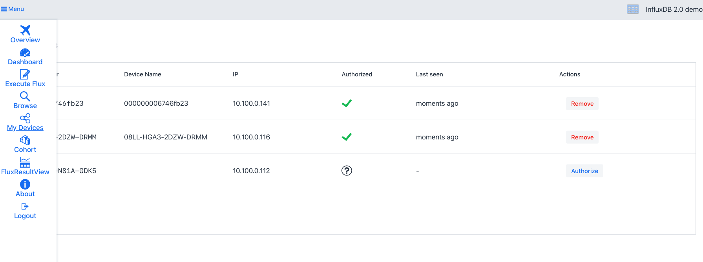
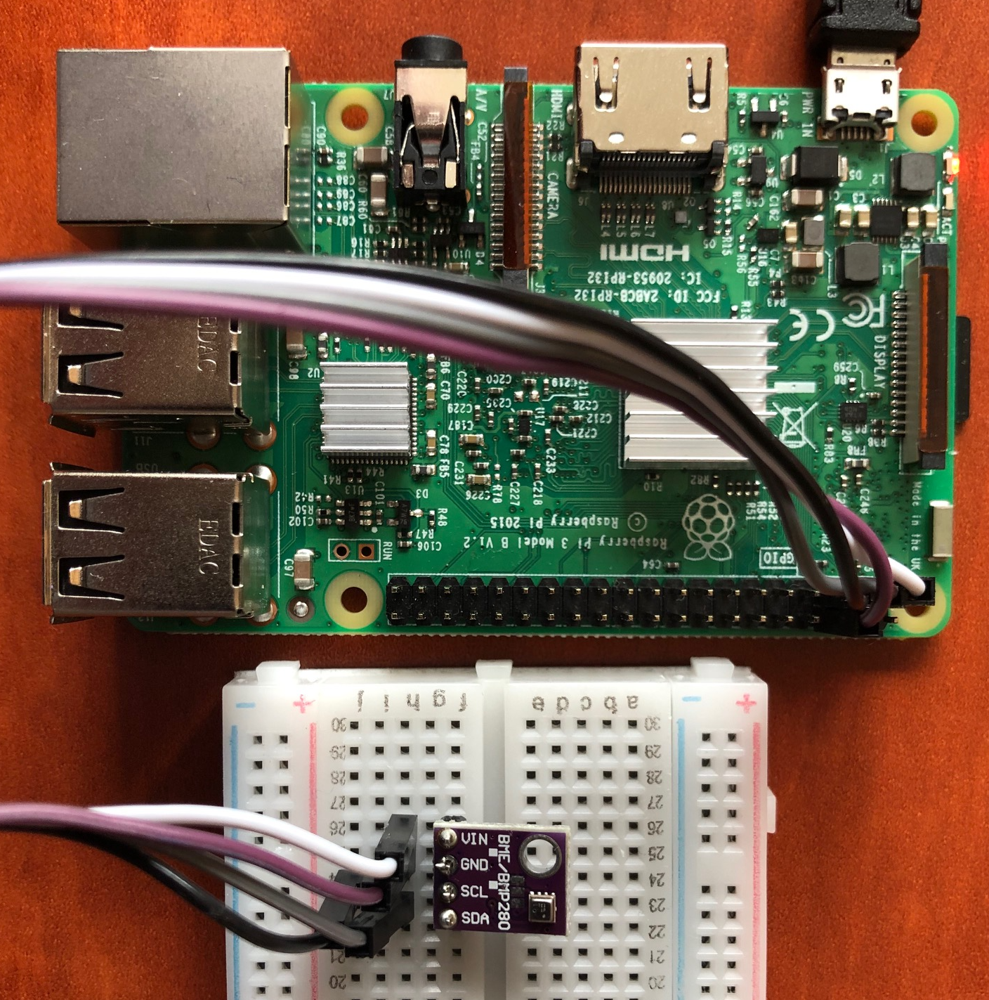

# IoT Pet Store Demo

[](https://travis-ci.org/rhajek/influx-demo)

A project example for using [InfluxDB 2.0 java client]([https://github.com/bonitoo-io/influxdb-client-java]) in Java/Spring ecosystem. 

* UI is implemented in Java using [Vaadin Flow](https://vaadin.com/flow) framework. 
* Backend is implemented using [Spring Boot](https://spring.io/projects/spring-boot). 
* [Micrometer.io](https://micrometer.io/) framework is used for monitoring, metrics are pushed into InfluxDB.

#### Architecture


## Prerequisites

The project can be imported into the IDE of your choice, with Java 8+ installed, as a Maven project.

Demo uses [Vaadin Charts](https://vaadin.com/components/vaadin-charts) library for the metrics visualization. Vaadin Charts is
commercial library and license file is needed in order to compile a run the demo. Free trial license can be obtained from https://vaadin.com/trial.

InfluxDB 2.0 must be started on localhost on default port 9999.

You can simply run `./scripts/influxdb-restart.sh` to create and setup InfluxDB 2.0 server in docker. 

 You can start the new clean instance of InfluxDB manually using docker
by following command: 

```bash
docker run --rm --name my-influxdb2 --publish 9999:9999 quay.io/influxdb/influx:nightly
```

InfluxDB must be initialized before the first usage. The user and the organization setup can be done using command line:

```bash

## onboarding
docker exec -it my-influxdb2 influx setup --username my-user --password my-password \
    --token my-token-123 --org my-org --bucket my-bucket --retention 48 --force

## show created orgId    
docker exec -it my-influxdb2 influx org find | grep my-org  | awk '{ print $1 }'

```
In the configuration file `src/main/resources/application.properties` put generated orgId into `influxdb.orgId` property.

## Workflow

To compile the entire project, run "mvn install" in the project directory.

Other basic workflow steps:

- getting started
  - run `mvn jetty:run` in ui module
  - open http://localhost:8080/
- creating a production mode war
  - run `mvn package -Dvaadin.productionMode ` 
- running in production mode
  - run `mvn jetty:run -Dvaadin.productionMode` 
  - open http://localhost:8080/

- running using spring-boot
  - run `mvn spring-boot:run -Dvaadin.productionMode` 
  - open http://localhost:8080/
  
  
## Prometheus metrics
-  http://localhost:8080/actuator/prometheus
 
## Screenshot example


## InfluxDB client Spring integration

IoT PetStore demo shows also how to integrate InfluxDB 2.0 client libraries into Spring Boot project. 

###  Micrometer.io integration
Micrometer is a great metrics instrumentation library for JVM-based applications. Starting with Spring Boot 2.0, Micrometer is the
default instrumentation library powering the delivery of application metrics. Using micrometer is possible to expose both
application and system level metrics. 

Spring boot [autoconfigures](https://docs.spring.io/spring-boot/docs/current/reference/htmlsingle/#production-ready-metrics-meter) most commonly used metrics for you, including:

* JVM, report utilization of:
    * Various memory and buffer pools
    * Statistics related to garbage collection
    * Thread utilization
    * Number of classes loaded/unloaded
* CPU usage
* Spring MVC and WebFlux request latencies
* RestTemplate latencies
* Cache utilization
* Datasource utilization, including connection pool metrics
* File descriptor usage
* Logback: record the number of events logged to Logback at each level
* System Uptime 
* Tomcat usage, user sessions 

Micrometer can use InfluxDB 2.0 as a target database for pushing metrics data.

Implementation ```io.micrometer.influx2.Influx2MeterRegistry``` is located in Bonitoo fork of Micrometer GitHub repository, 
[micrometer-registry-influx2](https://github.com/bonitoo-io/micrometer/tree/influx2-registry/implementations/micrometer-registry-influx2).

All configuration of micrometer exporter is in ```application.properties```.  

```properties
management.metrics.export.influx2.enabled=true
management.metrics.export.influx2.uri=http://localhost:9999/api/v2
management.metrics.export.influx2.org=my-org
management.metrics.export.influx2.bucket=micrometer-bucket
management.metrics.export.influx2.token=my-token-123
management.metrics.export.influx2.step=10s
```

### Configuration of InfluxDB 2.0 client library in Spring 

InfluxDB 2.0 client library can be seamlessly used in Spring. Client dependency injection and is possible to auto-configure using 
standard spring application properties. If the client is configured, actuator for InfluxDB health service is automatically enabled by default.

To enable InfluxDB 2.0 client in your Spring application, you need only to add maven dependency

```xml
<dependency>
  <groupId>com.influxdb</groupId>
  <artifactId>influxdb-spring</artifactId>
  <version>1.0.0-SNAPSHOT</version>
</dependency>
``` 

and configure client following client properties:

```properties
spring.influx2.url=http://localhost:9999
spring.influx2.org=03d802a38739a000
spring.influx2.bucket=my-bucket
spring.influx2.token=my-token-123
spring.influx2.username=my-user
```
After that you can  use ```@Autowired``` annotation and inject client ```com.influxdb.client.InfluxDBClient``` in your Spring service and component.

Source code and detail description of Spring and InfluxDB2.0 integration is located in    
[https://github.com/bonitoo-io/influxdb-client-java/tree/master/spring](https://github.com/bonitoo-io/influxdb-client-java/tree/master/spring) repository.

### Example of Raspberry IoT Device

Raspberry PI device that uses BME280 sensor for the air temperature, humidity and pressure. 
The device uses InfluxDB java client libraries to send metrics, [Pi4j](https://pi4j.com) library for communicate with the rPI bus and
BME280 code is adopted from [raspberry-coffee](https://github.com/OlivierLD/raspberry-coffee) library.

Sources are located in [device-java](./device-java) subdirectory of this project.

If you want to run that code on real rPI just change main runner class in [device-java/pom.xml](device-java/pom.xml) 
```
<!--<mainClass>io.bonitoo.demo.device.bme280.BME280Device</mainClass>-->
```

Thanks to [spring-boot-maven-plugin](https://docs.spring.io/spring-boot/docs/current/reference/html/deployment-install.html) 
it is easy to create natively executable jar file that can by run the directly from shell or integrated as 
[systemd](https://docs.spring.io/spring-boot/docs/current/reference/html/deployment-install.html#deployment-systemd-service) or [init.d](https://docs.spring.io/spring-boot/docs/current/reference/html/deployment-install.html#deployment-initd-service) service. 

```bash
cd device-java
mvn -Dmaven.test.skip=true package
java -Dlocation=Prerov  -Dpetstore.multicastAddress=230.0.0.0 -Dinterval=5 ./target/device-java-1.0-SNAPSHOT-spring-boot.jar

[pool-1-thread-1] INFO io.bonitoo.demo.device.Device - Searching for hub...
[Thread-0] INFO io.bonitoo.demo.device.DeviceDiscovery - Starting Hub discovery...
[Thread-0] INFO io.bonitoo.demo.device.DeviceDiscovery - Listening on en7 ip:231.0.0.0:4445
[Thread-0] INFO io.bonitoo.demo.device.DeviceDiscovery - Waiting for the message... name:en7 (en7) /231.0.0.0
[pool-1-thread-1] INFO io.bonitoo.demo.device.Device - Searching for hub...
[pool-1-thread-1] INFO io.bonitoo.demo.device.Device - Searching for hub...
[Thread-0] INFO io.bonitoo.demo.device.DeviceDiscovery - hubUrl discovered: http://10.100.0.112:8080/api !
[pool-1-thread-1] INFO io.bonitoo.demo.device.Device - Waiting for device authorization...
[pool-1-thread-1] INFO io.bonitoo.demo.device.Device - Saving configuration to: ./conf2.json
[RxNewThreadScheduler-2] INFO io.bonitoo.demo.device.Device - Write success. air,device_id=00000000XXXXXX,location=Prerov humidity=38.26288604736328,pressure=998.4058837890625,temperature=24.972904205322266 1559229158
[RxNewThreadScheduler-2] INFO io.bonitoo.demo.device.Device - Write success. air,device_id=00000000XXXXXX,location=Prerov humidity=38.22581481933594,pressure=998.4010009765625,temperature=24.970407485961914 1559229188
...

```

Our device will try to discover the PetStore API url using multicast on LAN, 
or custom url can be specified using -DhubApiUrl=http://localhost:8080/api system property.  Then you must authorize the device
by on http://localhost:8080/my-devices page.


 


Good resource for getting started for Raspberry with BME280 is located: 

* [https://www.raspberrypi-spy.co.uk/2016/07/using-bme280-i2c-temperature-pressure-sensor-in-python/](https://www.raspberrypi-spy.co.uk/2016/07/using-bme280-i2c-temperature-pressure-sensor-in-python/)


